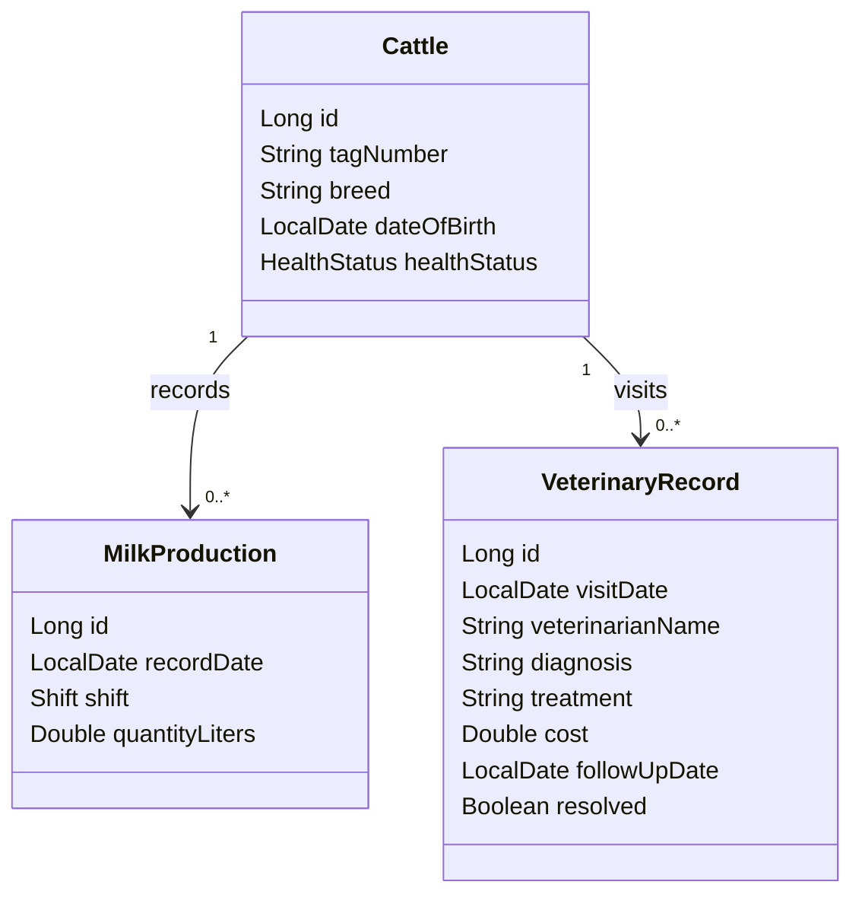

# Dairy Farm Management REST API

A Spring Boot REST API implementing full CRUD for three entities from the Dairy Farm
Management System domain: **Cattle**, **Milk Production**, and **Veterinary Record**.
It extends the original [DairyFarmManagementSystem](./DairyFarmManagementSystem) (JSF +
Hibernate) proposal by re-implementing Cattle and Milk Production as a REST API and
adding Veterinary Record — the animal-health tracking explicitly left out of that
project's initial scope.

## Abstract

Dairy farms need accurate, centralized cattle, production and health records to make
daily decisions. This API exposes create, read, update and delete operations for
cattle registration, milk production logging, and veterinary visit tracking, with
server-side validation and cross-entity business rules enforced in the service layer.

## Scope

- **Cattle**: registration and lifecycle (health status) tracking.
- **Milk Production**: per-shift production records linked to a cattle.
- **Veterinary Record**: health visits linked to a cattle, with a resolve workflow
  that updates the cattle's health status.

Authentication, payments, feed/inventory management, and reporting dashboards are
outside scope.

## Entity Relationship



## Business Requirements

| ID | Rule |
|---|---|
| BR-01 | Every cattle has a unique tag number, breed, date of birth and health status. |
| BR-02 | Cattle date of birth cannot be in the future. |
| BR-03 | Every milk production and veterinary record must reference an existing cattle. |
| BR-04 | Milk production stores a date, shift (MORNING/EVENING) and litres produced. |
| BR-05 | Full CRUD is available for Cattle. |
| BR-06 | Full CRUD is available for Milk Production. |
| BR-07 | Tag numbers must be 3-20 letters/digits/hyphens; quantity must be 0-100 litres. |
| BR-08 | Failed operations roll back and return a structured, user-facing JSON error (no stack traces leak). |
| BR-09 | A cattle can have at most one milk production record per shift per day. |
| BR-10 | Veterinary visit date cannot be future, cost cannot be negative, and a follow-up date (if given) must be after the visit date. |
| BR-11 | Creating a veterinary record moves the cattle to `UNDER_TREATMENT`; resolving the record (`PATCH /veterinary-records/{id}/resolve`) moves it to `RECOVERED`. |
| BR-12 | A cattle marked `DECEASED` cannot receive new milk production or veterinary records. |

## Technology Stack

| Item | Detail |
|---|---|
| Language | Java 21 |
| Framework | Spring Boot 4.1.1 (Spring Web, Spring Data JPA, Bean Validation) |
| Database | H2 (file-based, default) or PostgreSQL (`postgres` profile) |
| Build | Maven |
| Testing | Postman / Newman collection (see below) |

## Architecture

```text
Client (Postman / browser) -> REST Controllers -> Services (business rules) -> Spring Data Repositories -> Database
```

Each entity follows the same package layout:

```text
src/main/java/com/innovation/dairyfarm/<entity>/
  domain/      JPA entity (+ enums)
  repository/  Spring Data JPA repository
  dto/         Request/response records with Bean Validation
  service/     Interface + implementation holding business rules
  controller/  REST endpoints
```

Cross-cutting concerns (`BaseEntity`, custom exceptions, `GlobalExceptionHandler`)
live under `com.innovation.dairyfarm.common`.

## Running the API

### Default (H2, no external database required)

```bash
mvn spring-boot:run
```

The API starts on `http://localhost:8080` and persists to a local H2 file
(`./data/dairyfarmdb`). The H2 console is available at `/h2-console`.

> **Windows note:** if you need a fully clean rebuild, delete the `target/`
> directory manually (`rm -rf target` or `Remove-Item -Recurse -Force target`)
> before `mvn package` rather than running `mvn clean package` — on this project
> the `clean` goal was observed to race with file writes under a
> Desktop-synced folder and produce an empty jar. A plain `mvn package` after
> a manual delete works reliably.

### PostgreSQL profile (matches the original JSF project's database)

```bash
mvn spring-boot:run -Dspring-boot.run.profiles=postgres
```

Set `DB_URL`, `DB_USERNAME`, `DB_PASSWORD` environment variables beforehand, or
rely on the defaults in `application-postgres.properties`
(`jdbc:postgresql://localhost:5432/dairy_farm_db`).

### Building a jar

```bash
mvn -DskipTests package
java -jar target/dairyfarm-api-0.0.1-SNAPSHOT.jar
```

## API Endpoints

| Entity | Method | Path | Purpose |
|---|---|---|---|
| Cattle | POST | `/api/cattle` | Create |
| Cattle | GET | `/api/cattle` | List all |
| Cattle | GET | `/api/cattle/{id}` | Get one |
| Cattle | PUT | `/api/cattle/{id}` | Update |
| Cattle | DELETE | `/api/cattle/{id}` | Delete |
| Milk Production | POST | `/api/milk-productions` | Create |
| Milk Production | GET | `/api/milk-productions?cattleId=` | List all / by cattle |
| Milk Production | GET | `/api/milk-productions/{id}` | Get one |
| Milk Production | PUT | `/api/milk-productions/{id}` | Update |
| Milk Production | DELETE | `/api/milk-productions/{id}` | Delete |
| Veterinary Record | POST | `/api/veterinary-records` | Create |
| Veterinary Record | GET | `/api/veterinary-records?cattleId=` | List all / by cattle |
| Veterinary Record | GET | `/api/veterinary-records/{id}` | Get one |
| Veterinary Record | PUT | `/api/veterinary-records/{id}` | Update |
| Veterinary Record | PATCH | `/api/veterinary-records/{id}/resolve` | Resolve (BR-11) |
| Veterinary Record | DELETE | `/api/veterinary-records/{id}` | Delete |

Validation and business-rule failures return a structured error body:

```json
{
  "timestamp": "2026-09-20T00:23:30.505",
  "status": 400,
  "error": "Validation Failed",
  "message": "One or more fields are invalid.",
  "details": ["tagNumber: tagNumber must be 3-20 letters, digits or hyphens"]
}
```

## Testing via Postman

A ready-to-run collection and environment are in [`postman/`](./postman):

- `DairyFarmAPI.postman_collection.json` — full CRUD requests for all three
  entities plus dedicated negative-test requests for every business rule
  (BR-01, BR-02, BR-07, BR-09, BR-10, BR-11, BR-12), organized as
  Cattle → Milk Production → Veterinary Records → Deceased Cattle Guard → Cleanup.
- `DairyFarmAPI.postman_environment.json` — `baseUrl` plus chained id variables
  (`cattleId`, `milkProductionId`, `veterinaryRecordId`) that requests set and
  reuse automatically via test scripts.

**Import both files into Postman**, select the "Dairy Farm API - Local"
environment, start the API (`mvn spring-boot:run`), and run the collection
(Collection Runner, or per-folder). Every request carries a `pm.test` assertion
on status code (and on key response fields for the business-rule flows), so a
full pass/fail summary is produced automatically.

The same collection was verified headlessly with [Newman](https://github.com/postmanlabs/newman):

```bash
npx newman run postman/DairyFarmAPI.postman_collection.json \
  -e postman/DairyFarmAPI.postman_environment.json
```

Last verified run: **33 requests / 34 assertions, 0 failures.**

## CRUD Implementation Matrix

| Entity | Create | Read | Update | Delete |
|---|---|---|---|---|
| Cattle | `POST /api/cattle` | `GET /api/cattle`, `GET /api/cattle/{id}` | `PUT /api/cattle/{id}` | `DELETE /api/cattle/{id}` |
| Milk Production | `POST /api/milk-productions` | `GET /api/milk-productions`, `GET /api/milk-productions/{id}` | `PUT /api/milk-productions/{id}` | `DELETE /api/milk-productions/{id}` |
| Veterinary Record | `POST /api/veterinary-records` | `GET /api/veterinary-records`, `GET /api/veterinary-records/{id}` | `PUT /api/veterinary-records/{id}` | `DELETE /api/veterinary-records/{id}` |

## Links

- GitHub source code: **TO BE REPLACED WITH THE PUBLIC GITHUB REPOSITORY LINK**
- Google Vids project walkthrough (5-10 minutes, screen + camera): **TO BE REPLACED WITH THE GOOGLE VIDS SHARE LINK**

## Video Recording Plan

| Time | Content |
|---|---|
| 0:00-0:45 | Problem, objective, and why Veterinary Record extends the original scope |
| 0:45-1:30 | Entities and relationships (Cattle, Milk Production, Veterinary Record) |
| 1:30-2:15 | Architecture: controller -> service -> repository, validation and error handling |
| 2:15-3:30 | Cattle CRUD demonstration in Postman |
| 3:30-4:45 | Milk Production CRUD + duplicate-shift and range validation demo |
| 4:45-6:15 | Veterinary Record CRUD + resolve workflow (UNDER_TREATMENT -> RECOVERED) |
| 6:15-7:00 | Deceased-cattle guard rule (BR-12) demonstration |
| 7:00-7:30 | Wrap-up: Postman collection, GitHub repo, conclusion |

## Submission Checklist

- [ ] Replace the GitHub placeholder above with the public repository URL.
- [ ] Push the source code, this README, and the `postman/` collection to GitHub.
- [ ] Record the workflow using Google Vids with screen and camera enabled (5-10 min).
- [ ] Set sharing permission so the assessor can open the video.
- [ ] Replace the Google Vids placeholder above with the share URL.
- [ ] Confirm the jar builds with `mvn -DskipTests package` and runs with `java -jar target/dairyfarm-api-0.0.1-SNAPSHOT.jar`.
